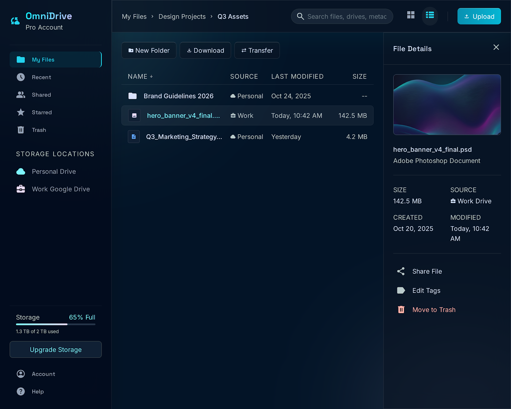
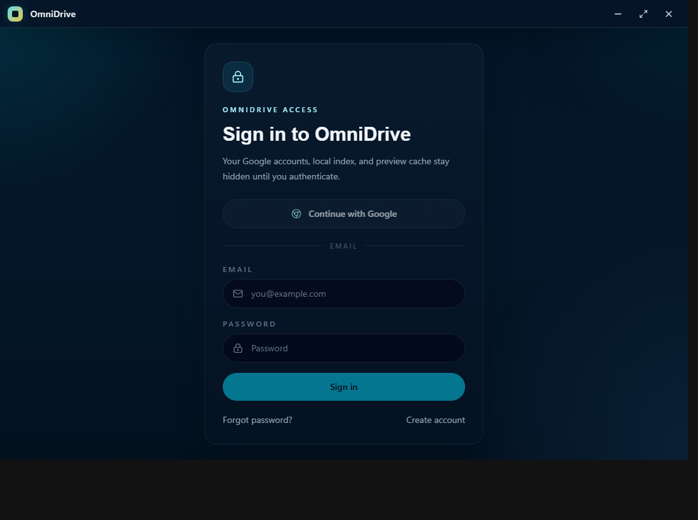

# OmniDrive

OmniDrive is a private desktop workspace for Google Drive. It lets you sign in to OmniDrive first, connect your Google accounts after that, and manage files from one clean app instead of jumping between browser tabs.

Your linked Google accounts, local file index, previews, and app metadata stay hidden until you unlock the app with your OmniDrive account.



## Why OmniDrive Exists

Most people end up with files spread across personal Google accounts, school accounts, work accounts, shared folders, and family storage. OmniDrive gives you one place to browse them while still keeping each signed-in OmniDrive user separated on the same computer.

Use it to:

- browse multiple Google Drive accounts from one desktop app
- keep Google account access behind an OmniDrive sign-in screen
- switch between folders, files, accounts, and file types quickly
- preview files without opening a pile of browser tabs
- upload, download, rename, delete, share, and transfer files
- use right-click menus and file details the way you would expect from a real drive app
- review storage and cleanup hints when your Drive starts getting messy

## Screenshots

OmniDrive starts locked. The workspace is not shown until your OmniDrive session is active.



After sign-in, your Drive workspace opens with search, view controls, file rows, preview details, and account-aware storage areas.


## How It Works

1. Install OmniDrive.
2. Sign in or create an OmniDrive account.
3. Verify your email if you signed up with email and password.
4. Connect one or more Google accounts from inside the unlocked workspace.
5. Browse, search, preview, upload, download, share, and organize your files.

Google sign-in for OmniDrive and Google Drive linking are separate. OmniDrive sign-in unlocks the app. Google Drive linking gives the unlocked app permission to access the Drive accounts you choose.

## Privacy Model

OmniDrive is built as a desktop-first app:

- Google OAuth tokens are stored through the operating system keyring.
- Local indexes and metadata are stored on your device.
- Local Google account data is namespaced per OmniDrive user.
- Signing out clears the in-memory workspace and returns to the locked screen.
- Another OmniDrive user on the same computer starts with their own local workspace.

OmniDrive does not auto-attach old device-wide Google data to a new OmniDrive user. Each user links their own accounts.

## Download

Download the latest desktop installer from [GitHub Releases](https://github.com/AbinanJeya/OmniDrive/releases).

Windows builds use a branded OmniDrive installer with options to add a Desktop shortcut and launch OmniDrive after setup. Linux builds are produced as AppImage, `.deb`, and `.rpm` packages when the release workflow runs.

## Current Status

OmniDrive is early desktop software. The main path is Google Drive browsing and management. Google Photos support is limited by Google's picker and session behavior, and macOS signing/notarization is not configured yet.

## Build From Source

You only need this section if you are developing OmniDrive locally.

Install dependencies:

```bash
npm install
```

Run the desktop app in development:

```bash
npm run tauri:dev
```

Build the frontend:

```bash
npm run build
```

Build the Windows installer:

```bash
npm run package:windows
```

### Local Environment

Create a `.env` file from `.env.example` when building locally:

```env
VITE_SUPABASE_URL=https://your-project.supabase.co
VITE_SUPABASE_ANON_KEY=your-supabase-publishable-or-anon-key
VITE_TURNSTILE_SITE_KEY=your-cloudflare-turnstile-site-key
VITE_GOOGLE_CLIENT_ID=your-google-client-id
GOOGLE_CLIENT_ID=your-google-desktop-client-id
GOOGLE_CLIENT_SECRET=your-google-desktop-client-secret
```

Supabase powers OmniDrive sign-in. Cloudflare Turnstile is used for signup protection when enabled in Supabase. Google OAuth credentials are used for the Drive connection flow.

## Tech Stack

- React, TypeScript, Vite, and Tailwind CSS for the interface
- Tauri 2 and Rust for the desktop backend
- Supabase Auth for OmniDrive sign-in
- Google Drive API for Drive access
- OS keyring plus a local SQLite index for device-local storage

## License

No license has been added yet.
